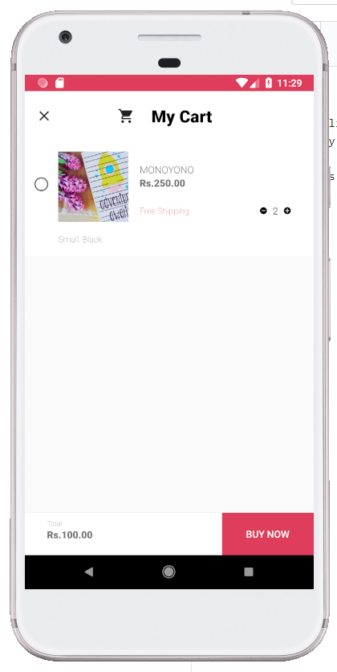

# Card Store
This is a online store which sells birthday cards, wedding cards, and much more craft works.  
There is only one backend user, the actual store owner. Ohter users are customers, they can find and buy cards they want.

# Screenshots

# Services Used
Database - Firebase (by GOOGLE) 
Android Studio 
Language - Java 

# Reffered Websites
Google material Design - https://material.io/ 
Android Developers Website - https://developer.android.com/ 
Firebase - https://firebase.google.com/ 
Design - https://dribbble.com/
Icons - https://www.flaticon.com/

# Reffered Youtube channels
Android Developer - https://www.youtube.com/user/androiddevelopers 
Firebase - https://www.youtube.com/user/Firebase 
Google Design - https://www.youtube.com/channel/UClKO7be7O9cUGL94PHnAeOA 
Google Developer - https://www.youtube.com/channel/UC_x5XG1OV2P6uZZ5FSM9Ttw 
